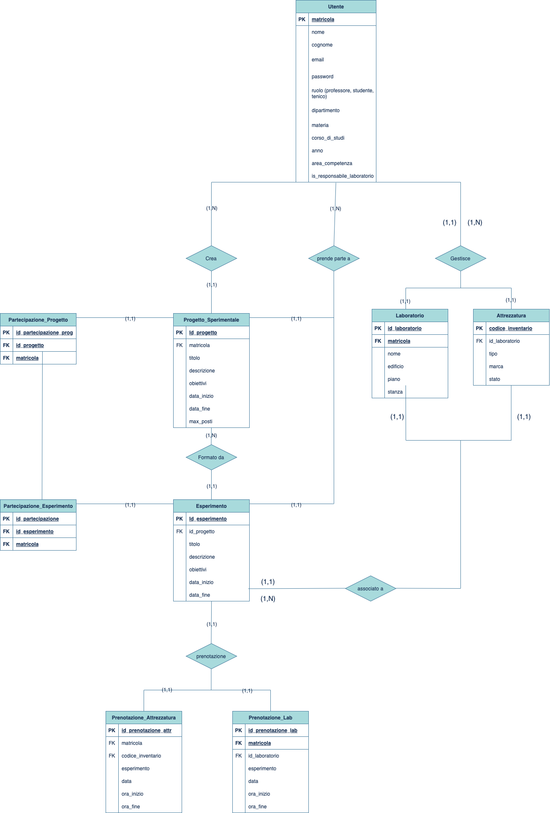

# UniLabManager – Sistema di Gestione Laboratori Universitari

Questo progetto è un'applicazione web sviluppata in Django per la gestione centralizzata delle attività didattiche e sperimentali all'interno dei laboratori universitari. 
L'obiettivo è offrire un'interfaccia moderna ed efficiente per la creazione e supervisione di progetti scientifici, la gestione di esperimenti e la prenotazione di attrezzature, con ruoli e permessi differenziati per Professori, Studenti e Tecnici. 

Il sistema simula un contesto accademico reale, garantendo l'integrità dei dati e la sicurezza degli accessi attraverso un'architettura personalizzata basata su ruoli. 

---

## Indice

- [Modello Entità/Relazione](#modello-entitàrelazione)
- [Funzionalità Principali](#funzionalità-principali)
- [Tecnologie Utilizzate](#tecnologie-utilizzate)
- [Installazione](#installazione)
- [Configurazione del Database](#configurazione-del-database)
- [Utilizzo](#utilizzo)
- [Interfaccia Web](#interfaccia-web)
- [Licenza](#licenza)

---

## Modello Entità/Relazione

Il modello E-R del progetto è stato progettato per supportare le interazioni tra utenti, progetti, esperimenti e risorse di laboratorio, adottando una generalizzazione con accorpamento nel padre per l'entità Utente. 



---

## Funzionalità Principali

L’applicazione offre una serie di funzionalità per coprire le esigenze dei tre ruoli principali del sistema:

**Registrazione e Login Sicuro**: Sistema di autenticazione basato su ruoli (Professore, Studente, Tecnico), con validazione del formato della matricola e password hashate. 
**Dashboard Personalizzate**: Ogni utente, dopo il login, visualizza un'area di lavoro con le funzionalità pertinenti al proprio ruolo. 
**Gestione Progetti ed Esperimenti**: I professori possono creare, visualizzare ed eliminare progetti di ricerca e associarvi esperimenti specifici. 
**Partecipazione Studenti**: Gli studenti possono visualizzare i progetti disponibili, iscriversi (nel rispetto del numero massimo di posti) e partecipare agli esperimenti. 
**Gestione Attrezzature**: I tecnici possono aggiungere nuove attrezzature e aggiornarne lo stato (es. "Funzionante", "In manutenzione"). 

---

## Tecnologie Utilizzate

- **Python**: Linguaggio di programmazione per lo sviluppo del backend.
- **Django**: Framework web utilizzato per la logica applicativa, il routing, l'autenticazione e l'ORM.
- **SQLite**: Database relazionale utilizzato di default per la sua semplicità e per essere file-based (non richiede un server separato).
- **HTML5 / CSS3 / Bootstrap**: Per la creazione di un'interfaccia utente moderna e responsive.
- **Django Templates**: Sistema di templating per il rendering dinamico delle pagine web.
- **Django Sessions**: Per la gestione dell'autenticazione e dei dati di sessione degli utenti.
- **Git + GitHub**: Per il versionamento del codice e la collaborazione.

---

## Installazione

Per eseguire l'applicazione in un ambiente di sviluppo locale, segui questi passaggi:

1.  Assicurati di avere **Python 3** installato sul tuo sistema.
2.  Clona questo repository:
    ```bash
    git clone [https://github.com/Andrea0333/Gestione_Lab_Scientifici_UNI.git](https://github.com/Andrea0333/Gestione_Lab_Scientifici_UNI.git)
    cd Gestione_Lab_Scientifici_UNI
    ```
3.  Crea e attiva un ambiente virtuale:
    ```bash
    # Su macOS/Linux
    python3 -m venv venv
    source venv/bin/activate
    
    # Su Windows (PowerShell)
    python -m venv venv
    .\venv\Scripts\Activate.ps1
    ```

4. Installa tutte le dipendenze del progetto:
    ```bash
    pip install -r requirements.txt
    ```
---

## Configurazione del Database

Questo progetto è pre-configurato per utilizzare **SQLite**, il database di default di Django. Non è richiesta alcuna configurazione esterna. Il file del database (`db.sqlite3`) verrà creato automaticamente nella cartella principale del progetto al primo avvio.

---

## Utilizzo

Dopo aver completato l'installazione, esegui i seguenti comandi dal terminale per inizializzare il database e avviare l'applicazione:

1.  Applica le migrazioni del database:
    ```bash
    python manage.py migrate
    ```
2.  Avvia il server di sviluppo locale:
    ```bash
    python manage.py runserver
    ```

L'applicazione sarà accessibile all'indirizzo **http://127.0.0.1:8000/**.

---


## Licenza

Questo progetto è distribuito con licenza [MIT](LICENSE). Puoi usarlo, modificarlo e distribuirlo liberamente.